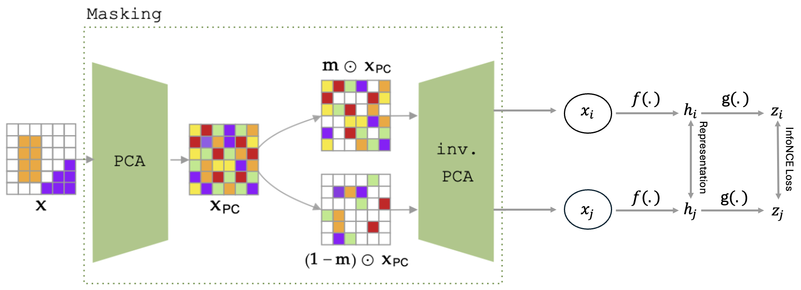

# SimCLR in PCA




## Files

```
data_aug/contrastive_learning_dataset: dataset object creation
data_aug/view_generator: create two views using PCAAugmentor
models/resnet_simclr: architectures
pca.py: apply pca to dataset
PCAAugmentorSimCLR: data augmentation strategies applied (shuffling, interpolation etc)
run: main function
utils: helper functions
```

## Running the model

```
In order to reproduce the results for SimCLR-PCA, you must first download the dataset you would like to work with into a folder named data.
The second step is to create a relevant PCA basis for the dataset.
```
